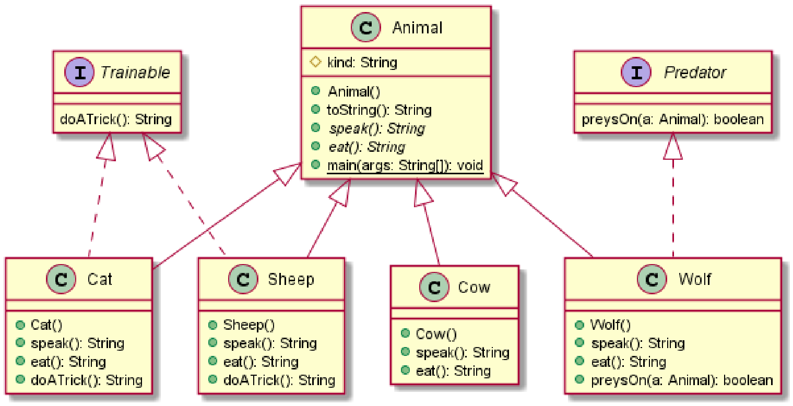
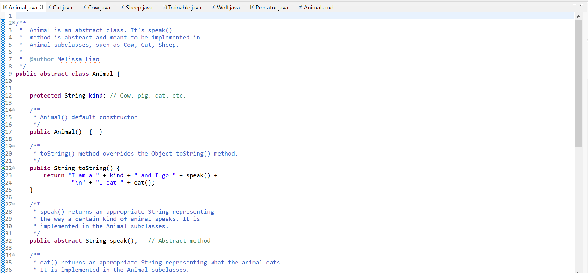
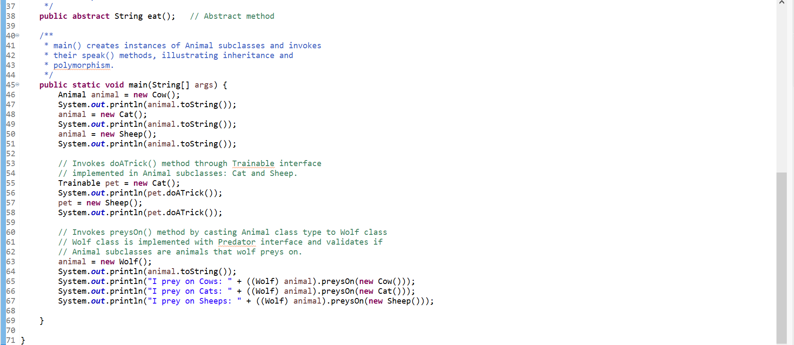
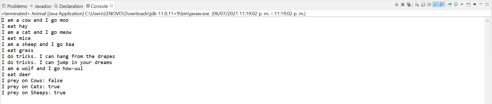

# Animals report
Author: Melissa Liao

## UML class diagram

## Answers to Questions in step 6
The first option, `Trainable pet = new Cow();`, is invalid because the Cow class doesn't have the Trainable interface implemented nor the doATrick() method is defined in itself.

The second option, `Animal pet2 = new Cat(); System.out.println(pet2.doATrick());`, is also invalid because is trying to instantiate an Animal class type through an extension of its subclass but Animal class itself doesn't have the Trainable interface implemented in it nor the doATrick() method is defined/cast in the class.

The third option, `Animal pet3 = new Cat(); System.out.println( ((Trainable)pet3).doATrick() );`, would be the only valid option because even when the Animal class type is instantiated without the implementation of Trainable interface in the class itself, the declaration casts out the Trainable interface type to call out doATrick() method.

## Execution and Testing

